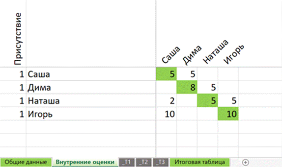
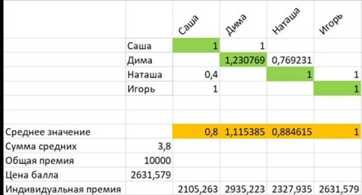
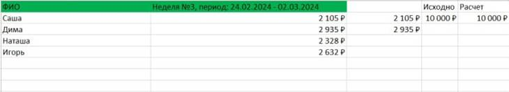

# Руководство по Умной премии

(версия 2.0, 12 марта 2025 г.)

Авторы:

Анна Гусянова

Иван Никитин mentane@mail.ru

## Введение

Мы можем управлять только тем, что проще нас. Исследование производственных взаимодействий опросом и в рамках умной премии показало, что фактическое взаимодействие представляет собой сложную взаимосвязанную структуру.

Схема взаимодействий по умной премии, сгруппированная по части подразделений: Эта схема показывает, как взаимодействия распределяются между подразделениями. Она помогает увидеть, какие отделы чаще взаимодействуют друг с другом и как это влияет на общую эффективность команды.  

Для управления такой сложной структурой и для достижения общей цели, необходима ещё более сложная целеустремленная система. Умная премия дает возможность снабдить каждого из участников инструментом влияния друг на друга. Это позволяет как получать обратную связь, так и давать ее другим. В результате такого взаимодействия команда эффективно движется к достижению общей цели.

Умная премия устроена сложно, но для каждого участника ее функции просты и понятны. Когда все следуют правилам премии, их действия объединяются, и система работает на общую цель.

Умная премия вдохновлена Методом Компас Водянова, но по замечанию Теслинова Андрея Георгиевича - это что-то новое.

## Что такое Умная премия?

Умная премия — это система позволяющая самим сотрудникам справедливо распределить премиальные выплаты, на основании того, насколько каждый сотрудник проявил себя в своей работе. В отличие от традиционных подходов, где премии часто распределяются по принципу стажа или должности, умная премия позволяет сотрудникам самим оценивать старания друг друга. Это означает, что премия распределяется не начальством, а вами — теми, кто ежедневно взаимодействует и видит, кто действительно прилагает усилия, а кто нет.

Основные механизмы умной премии:

- **Баланс общих и личных целей**. Развивающее противоречие между общей и индивидуальными целями, всегда нужно искать способ как повысить общий результат, так и способ, чтобы тебя ценила команда.
- **Усредненная оценка**. В эксперименте на ярмарке средняя оценка толпы, которая оценивала вес быка “на глазок”, лишь на полтора процента отличалась от измеренного веса. Таким образом, групповые оценки всегда точнее индивидуальных.
- **Равные права**. Каждый участник обладает одинаковым набором инструментов и правил. Каждый может отказаться от участия или вернуться
- **Снижение когнитивной сложности**. От каждого из участников требуется оценить только значимые взаимодействия, которые могли повлиять на эффективность/производительность/прибыльность компании 
- **Модельное мышление**. Это способ принимать решения, при котором человек сначала представляет себе общую картину (модель) того, как работает система или процесс, и только потом действует. Вместо того чтобы поступать «на автомате» или по привычке, участник анализирует, как его действия повлияют на общий результат. Переход к модельному мышлению происходит только если это выгодно, в Умной премии это обеспечивается распределением общего недельного вознаграждения
- **Малая цена ошибки**. Короткий период оценивания (неделя) и небольшая сумма премии снижают страх ошибиться. Участники чувствуют себя свободнее давать честную обратную связь, не боясь серьезных последствий или конфликтов. Это позволяет сосредоточиться на ценности замечаний. Короткие интервалы оценивания и умеренные суммы премии помогают команде быстрее находить и решать проблемы, учиться на ошибках и улучшать результаты без лишнего стресса
- **Частая обратная связь**. Участники быстро получают реакцию на свои действия, что помогает оперативно корректировать поведение.
- **Публичность оценки** — это важный элемент умной премии, который помогает создать культуру открытого и конструктивного общения в команде. Когда участники привыкают давать и получать обратную связь, то она воспринимается как часть рабочего процесса, а не как что-то личное или конфликтное. Это развивает ответственность, так как каждый понимает, что его мнение влияет на других, и учится формулировать мысли четко и тактично. Комментарии после оценок исключают недопонимание и позволяют быстро исправлять ошибки, что делает процессы более прозрачными и эффективными. В результате команда не только улучшает результаты, но и учится работать более слаженно и осознанно.
- **Личное участие**. При выставлении оценок участвует вербальная и невербальная коммуникация, что повышает качество обратной связи. Это помогает избежать недопонимания и укрепляет доверие в команде.
- **Горизонтальное распределение премии**. Премия распределяется самими сотрудниками. Это делает процесс более справедливым и прозрачным.

Как писал Спартак Никаноров, включенный независимыми экспертами Библиотеки Конгресса США в список 10 величайших ученых XX века на 7-е место (Эйнштейн был на 4-м месте): только то полезно, что опасно; и чем оно опаснее, тем оно полезнее. Премия - это очень опасный и полезный инструмент, данный документ даст вам понимание того, как именно устроена умная премия, чтобы помочь вам использовать его полезным образом. Используйте умную премию мудро!

## Глоссарий

●    **Умная премия (УП)** – система, при которой участники распределяют общую премию между собой на основе взаимных оценок.

●    **Общая цель** – показатель, заданный руководством (например, валовая выручка, чистая прибыль, прирост валовой выручки по сравнению с прошлым годом, прирост чистой прибыли по сравнению с прошлым годом), на основе которого рассчитывается размер премии.

●    **Общая премия** – сумма вознаграждения за неделю, рассчитываемая исходя из достижения цели; например, как X процентов от средней валовой выручки по закрытым счет-фактурам за предыдущие три недели.

●    **Оцениваемый период** – промежуток времени, неделя, за который выставляются оценки и рассчитывается премия.

●    **Общая шкала оценок** – шкала от 1 до 10, по которой участники оценивают взаимодействие друг с другом.

●    **Выставление оценок** – процесс, при котором члены команды оценивают вклад друг друга в достижение общей цели.

●    **Взаимодействие** – значимые действия рабочего процесса между участниками УП, которые повлияли на достижение общей цели.

●    **Участники** – сотрудники, которые принимают участие в системе Умной премии.

●    **Нормированная оценка** – оценка, скорректированная с учетом индивидуальной стратегии оценивающего, чтобы сделать оценки более справедливыми. Нормирование позволяет сравнивать между собой оценки тех, кто всем поставил 10 баллов и тех, кто всем поставил 5 баллов. По факту они оценили, что все проявили себя одинаково. В результате нормированное значение будет в виде 1 балла в обоих случаях.

●    **Цена балла** – сумма общей премии, деленная на общее количество нормированных оценок, что определяет стоимость одного балла.

●    **Индивидуальная премия** – часть общей премии, которую получает участник, рассчитанная на основе его средней оценки.

●    **Оценочные встречи** – собрания участников, на которых они выставляют оценки друг другу под руководством инструктора.

 

## Механизм расчета

1. **Расчет общей премии:**

2. 1. В начале каждой недели рассчитывается общая сумма премии. Она      может, например, составлять X% от средней валовой выручки за предыдущие      три недели.

3. **Собрание по выставлению оценок**:

4. 1. После окончания периода проводится встреча участников под      руководством инструктора. На этом собрании каждый участник выставляет      оценки другим членам команды (включая себя) по шкале от 1 до 10. Условная      единица отсчета – 5, середина, от которой можно двигаться как вверх, так      и вниз.
   2. **5** — вы полностью довольны работой      коллеги, человек справился со своей задачей на неделю.
   3. **Меньше 5** — есть замечания.
   4. **Больше 5** — ваш коллега выполнил куда      больше, чем от него требовалось, вы отмечаете его излишнюю старательность

5. **Нормирование     оценок**:

6. 1. Чтобы учесть разницу в строгости оценок разных участников, каждая      выставленная оценка нормируется. Это значит, что оценка делится на      среднее значение (моду) оценок, которые выставил конкретный участник.      Например, если кто-то обычно ставит высокие оценки, его оценки будут      скорректированы в меньшую сторону, чтобы сделать их сопоставимыми с      другими.

7. **Расчет средней нормированной оценки**:

8. 1. Для каждого участника вычисляется средняя оценка, которую он      получил от коллег. Это делается путем усреднения всех нормированных      оценок, выставленных ему другими участниками.

9. **Расчет цены балла**:

10. 1. Общая премия делится на сумму всех средних нормированных оценок      участников. Это дает стоимость одного балла (цену нормированного балла).      Например, если общая премия составляет 50 000 рублей, а сумма всех      средних оценок — 100 баллов, то цена одного балла будет 500 рублей. 

11. **Расчет индивидуальной премии**:

12. 1. Для каждого участника его индивидуальная премия рассчитывается      как произведение цены балла на его среднюю нормированную оценку.      Например, если участник получил среднюю оценку 1.5, а цена балла — 500      рублей, его премия составит 1.5 × 500 = 750 рублей.
    2. Таким образом, каждый участник может повысить свою индивидуальную      премию, как увеличив общий размер премии, так и увеличив свою долю в      «общем котелке».

## Кейс стади.

\1.     **Исходные данные**:

 

 

На примере данной таблицы разберем механизм расчетов в Умной премии при условии, что сумма общей премии составляет 10 000 рублей.

*Сотрудники в строках оценивают сотрудников в столбцах, в том числе сами себя.* 

 

Например Саша оценила себя и Диму на 5. Дима поставил оценку Наташе и отметил себя 8, объяснив это тем, что выполнил заказов больше, чем на предыдущей неделе. Наташа поставила себе и Игорю 5, а Саше 2, т.к. он четыре дня подряд опаздывал и игнорировал замечания. А Игорь поставил себе и Саше максимальный балл.

 

**2.**     **Расчет моды для каждого участника**

Для каждого участника вычисляем моду (самое часто встречающееся значение) или среднее арифметическое мод, если мод несколько.

- **Саша:**
  - Оценки: 5 (Дима), 5 (себе)
  - Мода = 5

- **Дима:**
  - Оценки: 5 (Наташе), 8 (себе)
  - Мода = (5+8)/2=6,5
- **Наташа:**
  - Оценки: 2 (Саше), 5 (Игорю), 5 (себе)
  - Мода = 5
- **Игорь:**
  - Оценки: 10 (Саше), 10 (себе)
  - Мода = 10

****

 

**3. Нормирование оценок**

Каждая оценка делится на моду участника, который её поставил. Это позволяет учесть разницу в строгости оценок. Это позволяет сформировать индивидуальную шкалу оценивания каждого участника. 

 **4. Расчет среднего арифметического по столбцам**

Теперь вычисляем среднее арифметическое нормированных оценок для каждого участника по столбцам (то есть на основе оценок, которые ему поставили другие).

- **Саша:**
  - Оценки:
    - От себя 5, мода своих оценок 5, тогда нормированная оценка - 5/5 = 1
    - От Наташи 2, мода оценок Наташи 5, тогда нормированная оценка 2/5 = 0.4
    - От Игоря 10, мода оценок Игоря 10, тогда нормированная оценка 10/10 = 1
  - Средняя оценка = (1 + 0.4 + 1) / 3 = 2.4 / 3 = 0.8
- **Дима:**
  - Оценки:
    - от Саши: 10/10 = 1
    - от себя: 8/6,5 ≈ 1.23)
  - ○    Средняя оценка = (1 + 1.23) / 2 = 2.23 / 2 = 1.115
- **Наташа:**
  - Оценки:
    - от Димы: 5/6.5 = 0.77
    - от себя: 5/5 = 1
  - Средняя оценка = (0.77 + 1) / 2 = 1.77 / 2 ≈ 0.885
- **Игорь:**
  - Оценки:
    - от Наташи: 5/5 = 1
    - от себя: 10/10 = 1
  - Среднее = (1 + 1) / 2 = 1

 

**5. Сумма средних оценок**

0.8 (Саша) + 1.115 (Дима) + 0.885 (Наташа) + 1 (Игорь) = 3.8

**6. Расчет стоимости одного балла**

Общая премия составляет 10 000 рублей. Чтобы найти стоимость одного балла, делим общий размер премии на сумму средних оценок:

Стоимость одного балла = 10 000 рублей / 3.8 ≈ 2 632 рублей

**7. Распределение премии**

Теперь умножаем среднюю оценку каждого участника на стоимость одного балла и получаем индивидуальную премию за неделю:

●    Саша: 0.8 × 2 632 ≈ 2 105 рублей

●    Дима: 1.115 × 2 632 = 2 934 рублей

●    Наташа: 0.885 × 2 632 ≈ 2 329 рублей

●    Игорь: 1 × 2 632 = 2 632 рублей

## Метафора

Умную премию можно сравнить с тем, как команда получает котелок с кашей соответственно результатам работы за неделю. При этом каждый из участников говорит:

\-    я считаю, что я, Петя, Вася и Маша поработали одинаково очень хорошо (и должны получить одинаковую порцию);

\-    а я считаю, что я, Миша и Маша поработали одинаково очень плохо (и должны получить одинаковую порцию).

\-    а я считаю, что Маша поработала хуже меня (значит Маша должна получить меньше, чем я)

 Таким образом, Умная премия собирает мнения участников о том, как распределить общий котелок на всех. Затем приводит все мнения к единой шкале оценки и рассчитывает, кому какая доля котелка достанется.

 И чем больше “котелок”, тем больше может достаться каждому. Если при общей премии в 10.000 рублей, в среднем участники получают по 2.500 рублей. То увеличив общую премию до 50.000, они начнут получать 7.500 рублей.

 Чем дольше вы проводите умную премию, тем дольше вы едите из этого “котелка”.

Для этого необходимо сделать так, чтобы этот “котелок” окупался и был выгоден руководству. Т.к. если те X %, которые компания инвестируют в Умную премию не окупятся, причин продолжать эту благотворительность не будет.

 Все зависит от вас!

## 

## Вопросы для самопроверки

 

1. Я получил оценку от Василия в 10 баллов, при этом Василий выставил     всем оценки в 10 баллов; с другой стороны Николай выставил мне 8 баллов, а     всем остальным выставил 4 балла. Кто из них оценил мой вклад в работу как     более значимый и считает, что я должен получить большую премию, чем     остальные?

2. 1. Невозможно ответить
   2. **Николай**
   3. Василий
   4. Оба оценили одинаково

3. В оцениваемом период Василий очень хорошо поработал, все остальные     поставили друг другу по 5 баллов, а Василию ставили 10. Я считаю, что     Василий хорошо поработал; всем остальным поставил 5 и решаю Василию тоже     поставить 5 баллов. Тем самым я:

4. 1. Не изменил оценку вклада Василия в общий результат и не изменил      ту долю общей премии, которую он получит
   2. Увеличил долю общей премии, которую получит Василий
   3. **Уменьшил долю общей премии, которую получит Василий**
   4. Увеличил размер общей премии

5. В оцениваемом период Наталья выставила всем сотрудникам 5 баллов,     Мария всем сотрудникам выставила 8 баллов, а Иван выставил всем     сотрудникам 10 баллов. В результате:

6. 1. Наталья уменьшила долю в общей премии оцененных сотрудников по      сравнению с Иваном, но увеличила по сравнению с Марией
   2. Иван увеличил долю оцененных сотрудников в общей премии больше чем Мария и Наталья
   3. Мария увеличила долю оцененных сотрудников в общей премии больше чем Иван и Наталья
   4. **Все оценили долю оцененных сотрудников одинаково**

 